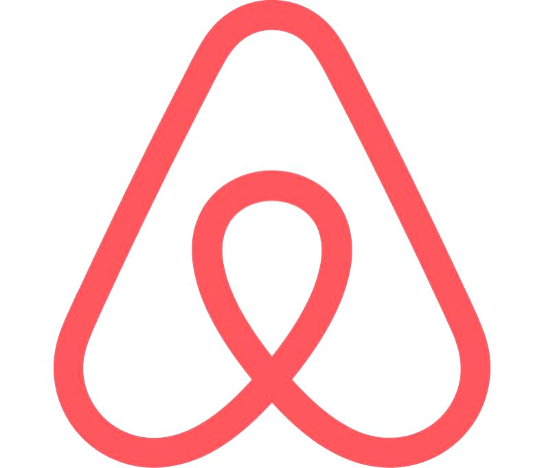
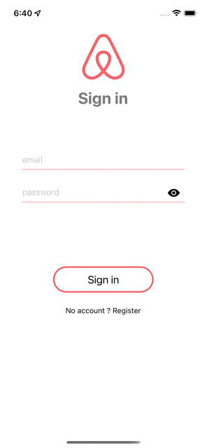
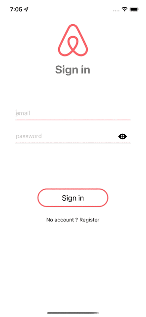

<div style= "display: flex; align-items:center; gap: 20px; ">
 <p style="font-size: 40px">Airbnb</p>
</div>

This is a simplified replica of airbnb mobile app.

## Features

- Sign-in and signup features
- User image upload from the media library or taking picture via the integrated phone camera
- User localisation
- Showing offers from a backend api
- Getting offers around a user

## Packages/Technologies

- React Native + Expo
- React
- Expo SDK (camera, photos, etc.)
- mapview (localisation)

## Screen captures

<div style="display: flex; justify-content: space-between; gap: 10px; background-color: black;">






</div>

## Installation

1. Clone the repository :

   ```bash
   git clone https://github.com/btboubacar/airbnb-app

   ```

2. enter the app directory :
   ```bash
   cd airbnb-app
   ```
3. Install the dependencies:
   ```bash
   npm install
   # ou
   yarn install
   ```
4. Launch the application :
   ```bash
   npx expo start
   # ou
   yarn start
   ```
